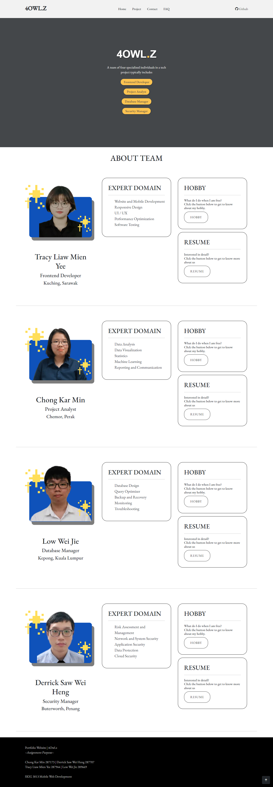
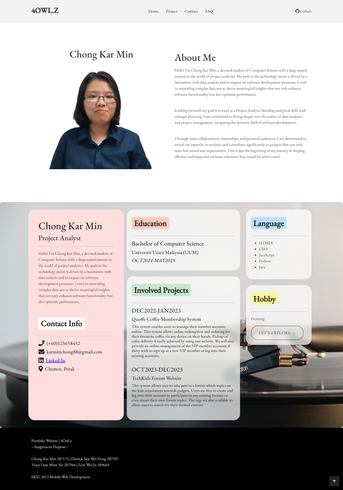

  4Owl.z  
  

## Table of Contents
1. [Team Overview](#team-overview)
2. [Introduction](#introduction)
3. [Technologies Used](#technologies-used)
4. [Features](#features)
5. [Website Screenshots](#website-screenshots)
   - [4Owl.z Landing Page](#4owlz-landing-page)
   - [4Owl.z Home Page](#4owlz-home-page)
   - [4Owl.z Portfolio Page](#4owlz-portfolio-page)
   - [4Owl.z Hobby Page](#4owlz-hobby-page)
   - [4Owl.z Project Page](#4owlz-project-page)
   - [4Owl.z FAQ Page](#4owlz-faq-page)
   - [4Owl.z Contact Page](#4owlz-contact-page)

## Team Overview

**Team 4Owl.z** comprises four members from the Bachelor of Computer Science program at Universiti Utara Malaysia. Each member plays a vital role in the software development process.

## Introduction

The **4 Owl.z Website** showcases the profiles of our team members. It features detailed information about each member, including their identity, description, projects, achievements, resume, and hobbies. The website also highlights past projects undertaken by the team and facilitates inquiries and contact through an integrated platform.
This website is aligned with the assignment02 for the subject SKIG3013 Mobile Web Development.

### Technologies Used
- HTML5
- CSS3
- Bootstrap
- JavaScript
- Flask
- SQLite3
- GitHub (for version control and workflow management)
- Google Collab (for collaborative development)
- Google Drive (for collaborative development )

### Installation Guide

To set up the project locally, follow these steps:
1. Download the project zip file and unzip it
2. Upload the folder to Google Drive
3. Open the app.ipnyb file in Google Colaboratory
4. Run all commands and open the link provided

### Features

- **Team Profiles**: Detailed information about each team member.
- **Projects**: Explore our team's past projects and accomplishments.
- **FAQ, Contact and Cooperation**: Reach out to us for inquiries or potential collaborations.

## Website Screenshots

### 4Owl.z Landing Page

### 4Owl.z Home Page

### 4Owl.z Portfolio Page
Individual portfolio pages for each member.

### 4Owl.z Hobby Page
Discover the hobbies and interests of our team members.

### 4Owl.z Project Page
View all past and ongoing team projects.

### 4Owl.z FAQ Page
Questions on 4OwlZ.

### 4Owl.z Contact Page
Get in touch with the 4Owlz team.

---
